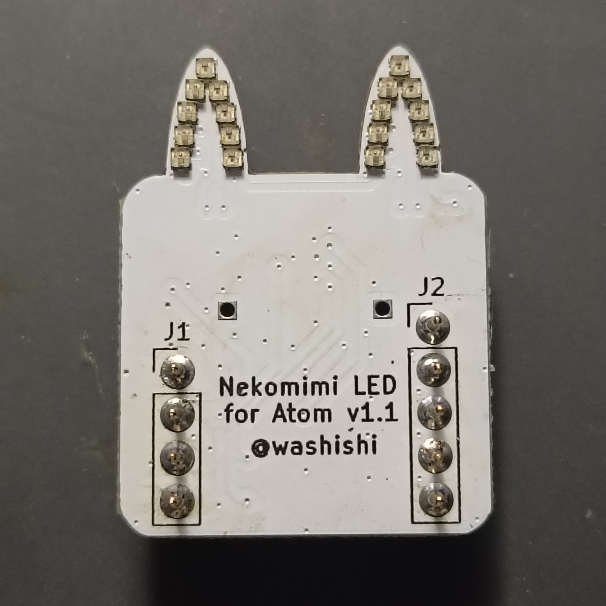
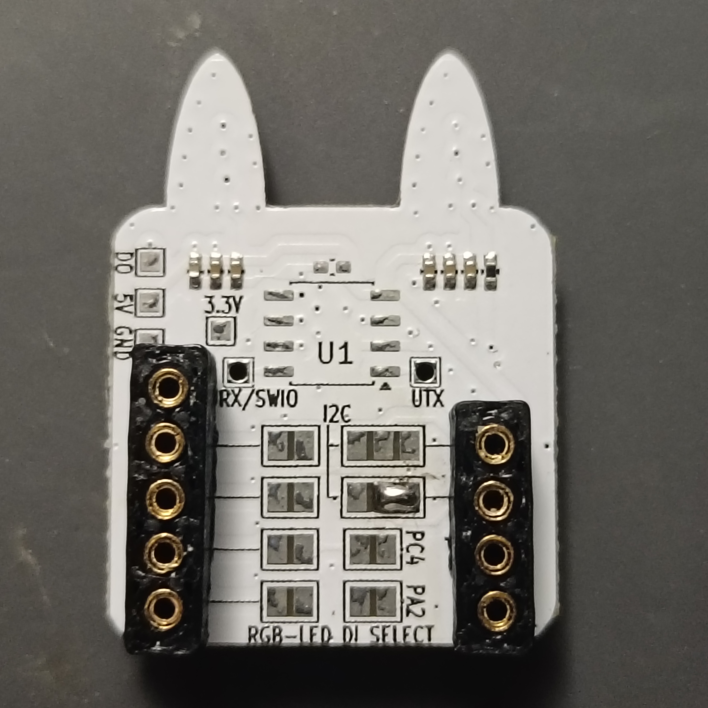
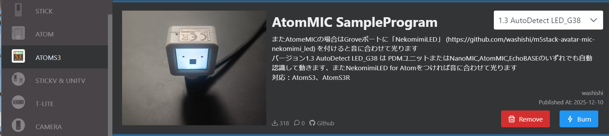
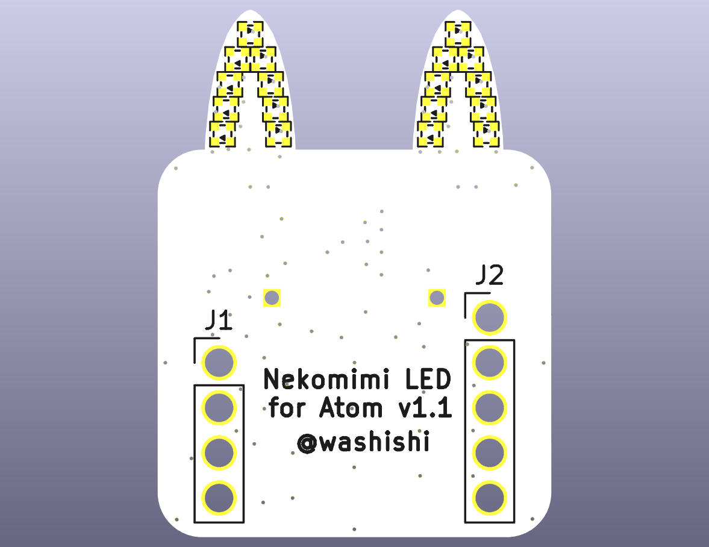
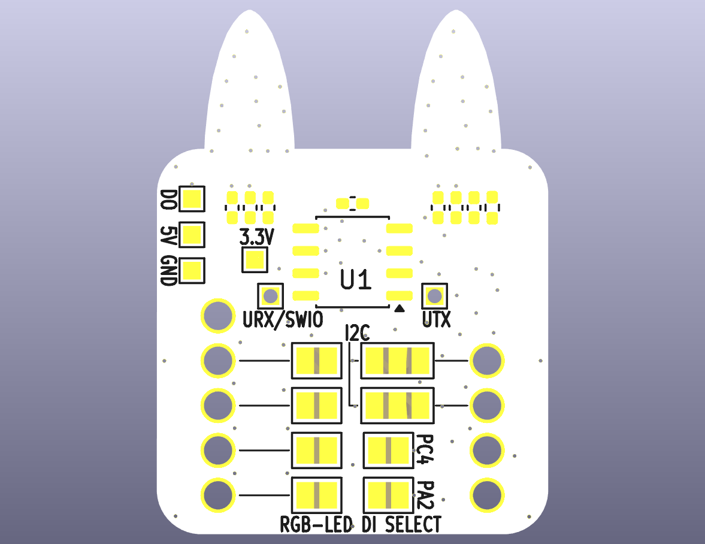
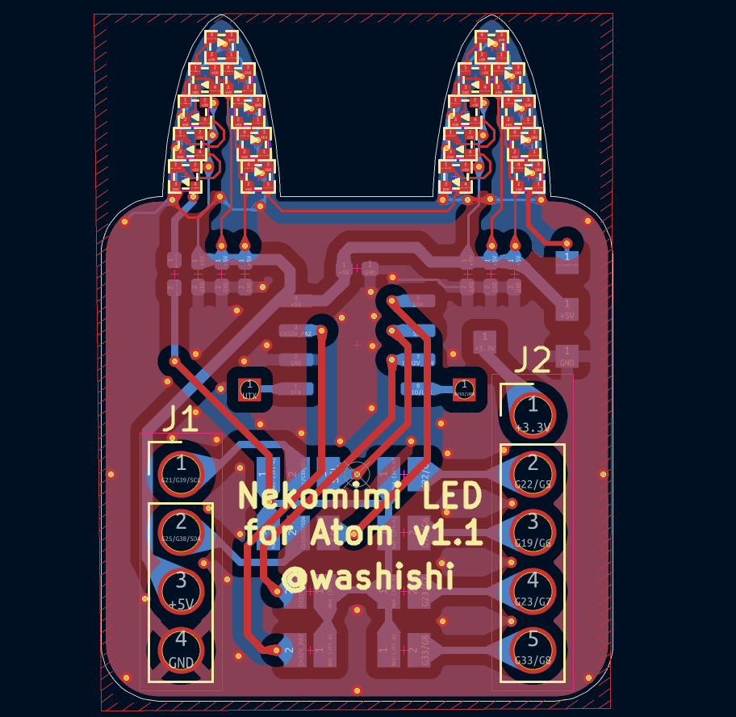
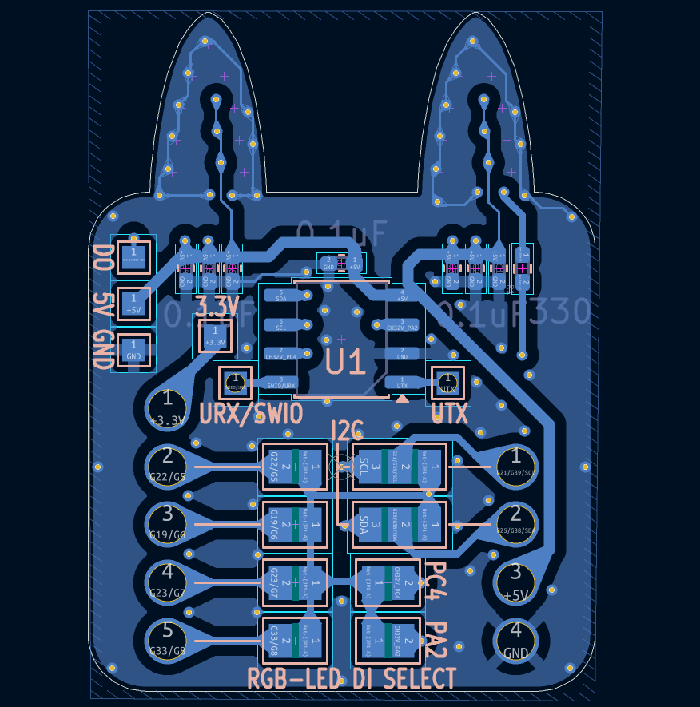
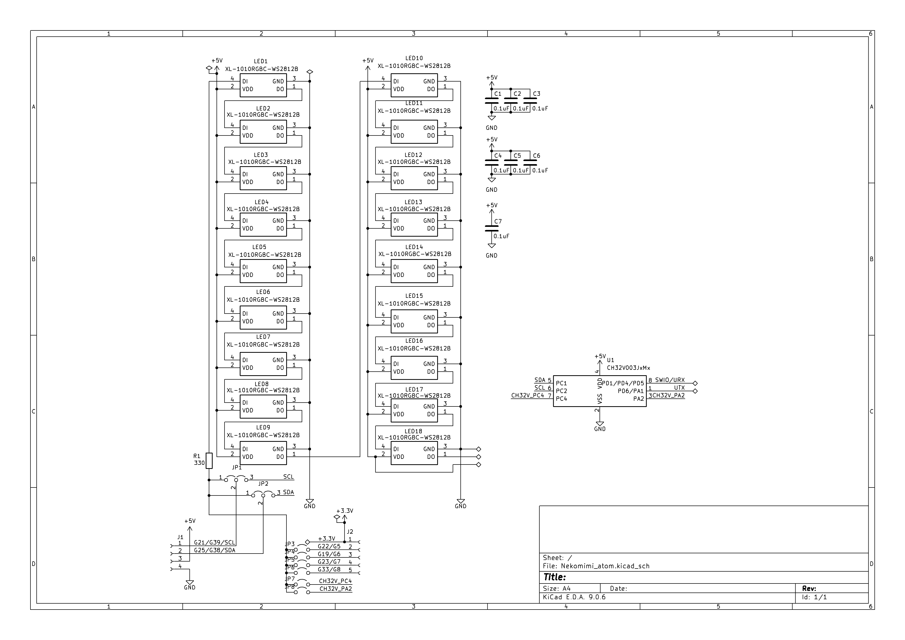

# Nekomimi LED  for Atom
M5StackのAtomシリーズ用(AtomU/S3U以外)のネコミミ型LED基板です  
NeoPixel(WS2812)互換の1mmx1mmサイズのRGB LEDが左右に9個ずつ合計18個付いており独立して色や明るさ等を制御することができます  

  

## 使い方
M5Stack Atomシリーズ裏面のピンソケットに本基盤のピン部分を差し込んで取り付けます

### 使用するGPIO（ピン）
  

使用するGPIO端子は上記写真の赤枠のランドいずれかをはんだでショートすることにより選択できます  
[BOOTH](https://washishi.booth.pm/)等で頒布するものは上記写真のように右側上から２番目の端子が既にショートされています  
その場合の利用するGPIOは下記となります  
|Atom種別|LED Data Out|
|:--|:-:|  
|AtomS3/S3R/S3Lite/S3RCAM/S3REx/EchoS3R等S3系|G38|
|AtomLite/AtomMatrix/AtomEcho等S3系以外|G25|

## ソフトウエアでの利用について
Arduino IDE や VSCode + PlatformIO で利用する場合は
[FastLED](https://github.com/FastLED/FastLED)や[Adafruit NeoPixel](https://github.com/adafruit/Adafruit_NeoPixel)等のライブラリで利用できます  
UIFlowで利用する場合はHardwareでRGBを追加し利用するGPIOとLEDの数18を指定すれば利用できます  
その他に関しても NeoPixel を操作できるライブラリ等があれば利用できると思います  

利用上の注意点：
- ECHO BASEと併用する場合はI2Cで利用している端子をスピーカ、マイクの初期化後にI2Cでの利用を停止してから利用可能です  
- 利用するGPIOをまず出力、LOWレベルで初期化してください(行わないとLEDが意図した点灯とならない場合があります)  
&ensp;例： (GPIO38利用時)  
&emsp;(スピーカ、マイク等初期化処理)  
&emsp;Wire.end();&emsp;// ECHO BASE併用時にI2Cでの利用を終了  
&emsp;digitalWrite(GPIO38, LOW);&emsp;// GPIOを出力、LOWレベルで初期化  
&emsp;(FastLED等LEDライブラリでの初期化)

## サンプルプログラム
サンプルプログラムとして [m5stack-avatar-mic-nekomimi_led](https://github.com/washishi/m5stack-avatar-mic-nekomimi_led) を用意しました (「M5AtomS3-ECHO_BASE_PDM-LED38」をビルドしてください)  
※Takao Akaki (mongonta0716) さんの [m5stack-avatar-mic](https://github.com/mongonta0716/m5stack-avatar-mic)を改変したものとなります

音に合わせてAvatarが口パクしたり、傾いたりすると共にNekomimi LED For Atomが音量に応じて光ります    
※利用するには下記いずれかでマイクを取り付ける必要があります  
- [EchoBASE](https://docs.m5stack.com/ja/atom/Atomic%20Echo%20Base)  
- [Atom MIC](https://github.com/washishi/atom_mic)
- Grove端子に[NanoMIC](https://github.com/washishi/NanoMIC)または[Unit Mini PDM](https://docs.m5stack.com/ja/unit/pdm)  

上記のビルド済みバイナリーはM5Burnerで配布もしています  
    

## 回路図、BOM、ガーバデータ等
本リポジトリ schematics ディレクトリ配下に設計ファイル一式があります  

  

  

### BOM(使用部品リスト)
|番号|名称|仕様/型番|メーカー|個数|備考購入先|  
|:--|:--|:--|:-:|:-:|:-:|  
|-|基板|NekomimiLED for Atom基板 [ガーバデータ](schematics/production/Nekomimi_atom.zip)|-|1|[JLCPCB](https://jlcpcb.com/JPV)へ発注|
|LED1-18|マイコン内蔵RGBLED|XL-10サイズ1-0RGBC-WS2812B|XINGLIGHT|18|[LCSC](https://www.lcsc.com/product-detail/C5349953.html)|  
|R1|チップ抵抗|330Ω 0402/1005(mm)サイズ|任意|1||[マルツ](https://www.marutsu.co.jp/pc/i/856730/) (通販)  
|C1-C6|チップ積層セラミックコンデンサ|0.1uF 0402/1005(mm)サイズ|任意|6|[秋月電子](https://akizukidenshi.com/catalog/g/g113377/) (25個セット)|
|J1-2|ピンソケット|1P 普通のピンヘッダ(0.64mm角)が刺せる物、胴体1.5mm丸 足0.6mm丸|不明|9|[Aiexpresss](https://ja.aliexpress.com/item/1005007125065810.html) E-Simpo Store (500個セット)
|J1|ピンソケット用枠|[4P用モデルデータ](schematics/ピンソケット_4P.step)|-|1|3Dプリンタで出力
|J1|ピンソケット用枠|[5P用モデルデータ](schematics/ピンソケット_5P.step)|-|1|3Dプリンタで出力

#### オプション  
&emsp;頒布品では未実装の部品  
&emsp;当初ECHO BASE利用時はマイコン(CH32V003)を載せてI2Cでの利用を考えていた際の名残  
&emsp;動作未検証およびマイコンのプロクラムについては未作成  
&emsp;実装してマイコンのプログラムを書き電源だけ繋いで単独でLEDを光らしたりできるかもしれない  
|番号|名称|仕様/型番|メーカー|個数|備考購入先|  
|:--|:--|:--|:-:|:-:|:-:|  
|U1|マイコン|CH32V003J4M6|Nanjing Qinheng Microelectronics|1|[秋月電子](https://akizukidenshi.com/catalog/g/g118062/)|
|C7|チップ積層セラミックコンデンサ|0.1uF 0402/1005(mm)サイズ|任意|1|[秋月電子](https://akizukidenshi.com/catalog/g/g113377/)(25個セット)|
